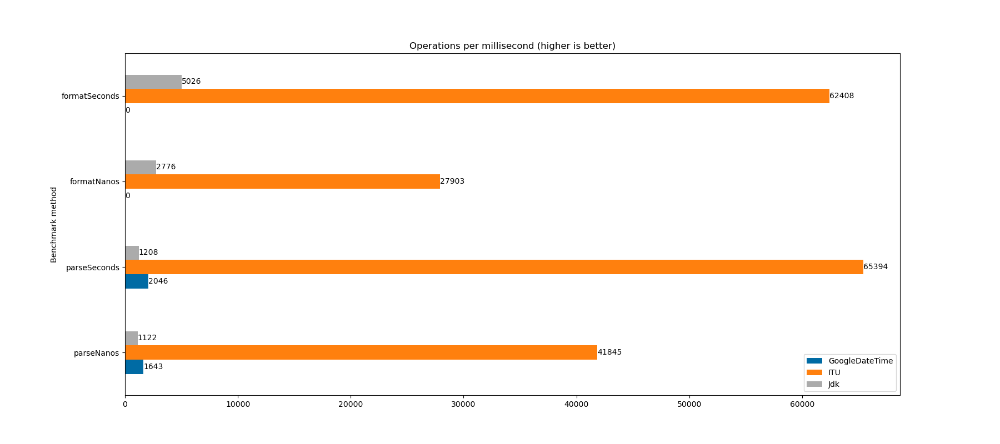

# Internet Time Utility

[](http://search.maven.org/#search%7Cga%7C1%7Cg%3A%22com.ethlo.time%22%20a%3A%22itu%22)
[](LICENSE)

An extremely fast parser and formatter of ISO format date-times.

> Date and time formats cause a lot of confusion and interoperability problems on the Internet. This document addresses many of the problems encountered and makes recommendations to improve consistency and interoperability when representing and using date and time in Internet protocols.

This project's goal it to do one thing and to do it right; make it easy to
handle [Date and Time on the Internet: Timestamps](https://www.ietf.org/rfc/rfc3339.txt) and
W3C [Date and Time Formats](https://www.w3.org/TR/NOTE-datetime) in Java.

## Features
* Very easy to use
* No external dependencies, minimal JAR size
* Apache licensed, can be used in any project, even commercial
* Handling of leap-seconds
* Very high performance

## Performance

Your mileage may vary, but tests indicate comfortably 10x faster than JDK classes.


Tests performed on a Dell XPS 9700
* Intel(R) Core(TM) i7-10750H CPU @ 2.60GHz
* Ubuntu 21.10
* OpenJDK version 11.0.13

### Run tests yourself
```shell
mvn jmh:benchmark
```

To plot the result and create the resulting image, you can run `plot.py`.

## Example usage

Add dependency

```xml
<dependency>
  <groupId>com.ethlo.time</groupId>
  <artifactId>itu</artifactId>
  <version>1.6.0</version>
</dependency>
```

```java
import java.time.OffsetDateTime;
import com.ethlo.time.DateTime;
import com.ethlo.time.ITU;

// Parse a string
final OffsetDateTime dateTime = ITU.parseDateTime("2012-12-27T19:07:22.123456789-03:00");

// Format with no fraction digits
final String formatted = ITU.formatUtc(dateTime); // 2012-12-27T22:07:22Z

// Format with microsecond precision
final String formattedMicro = ITU.formatUtcMicro(dateTime); // 2012-12-27T22:07:22.123457Z

// Parse lenient, raw data
final DateTime dateTime = ITU.parse("2012-12-27T19:07Z");

```

### Handle leap-seconds
```java
try 
{
  final OffsetDateTime dateTime = ITU.parseDateTime("1990-12-31T15:59:60-08:00");
}
catch (LeapSecondException exc) 
{
  // The following helper methods are available let you decide how to progress
  exc.getSecondsInMinute(); // 60
  exc.getNearestDateTime() // 1991-01-01T00:00:00Z
  exc.isVerifiedValidLeapYearMonth() // true
}
```

## Q & A

*Why this little project?*

There are an endless amount of APIs with non-standard date/time exchange, and the goal of this project is to make it a
no-brainer to do-the-right-thing(c).

*Why the performance optimized version?*

Some projects use epoch time-stamps for date-time exchange, and from a performance perspective this *may* make sense
in *some* cases. With this project one can do-the-right-thing and maintain performance in date-time handling.

*What is wrong with epoch timestamps?*

* It is not human-readable, so debugging and direct manipulation is harder
* Limited resolution and/or time-range available
* Unclear resolution and/or time-range

## What is RFC-3339?

[RFC-3339](https://www.ietf.org/rfc/rfc3339.txt) is a subset/profile defined by [W3C](https://www.w3.org/) of the
formats defined in [ISO-8601](http://www.iso.org/iso/home/standards/iso8601.htm), to simplify date and time exhange in
modern Internet protocols.

Typical formats include:

* `2017-12-27T23:45:32Z` - No fractional seconds, UTC/Zulu time
* `2017-12-27T23:45:32.999Z` - Millisecond fractions, UTC/Zulu time
* `2017-12-27T23:45:32.999999Z` - Microsecond fractions, UTC/Zulu time
* `2017-12-27T23:45:32.999999999Z` - Nanosecond fractions, UTC/Zulu time
* `2017-12-27T18:45:32-05:00` - No fractional seconds, EST time
* `2017-12-27T18:45:32.999-05:00` - Millisecond fractions, EST time
* `2017-12-27T18:45:32.999999-05:00` - Microsecond fractions, EST time
* `2017-12-27T18:45:32.999999999-05:00` - Nanosecond fractions, EST time

## What is W3C - Date and Time Formats

[Date and Time Formats](https://www.w3.org/TR/NOTE-datetime) is a _note_, meaning it is not endorsed, but it still
serves as a sane subset of ISO-8601, just like RFC-3339.

Typical formats include:

* `2017-12-27T23:45Z` - Minute resolution, UTC/Zulu time
* `2017-12-27` - Date only, no timezone (like someones birthday)
* `2017-12` - Year and month only. Like an expiry date.

## Limitations

### Local offset

For the sake of avoiding data integrity issues, this library will not allow offset of `-00:00`. Such offset is described
in RFC3339 section 4.3., named "Unknown Local Offset Convention". Such offset is explicitly prohibited in ISO-8601 as
well.

> If the time in UTC is known, but the offset to local time is unknown, this can be represented with an offset of "-00:00". This differs semantically from an offset of "Z" or "+00:00", which imply that UTC is the preferred reference point for the specified time.

### Leap second parsing

Since Java's `java.time` classes do not support storing leap seconds, ITU will throw a `LeapSecondException` if one is
encountered to signal that this is a leap second. The exception can then be queried for the second-value. Storing such
values is not possible in a `java.time.OffsetDateTime`, the `60` is therefore abandoned and the date-time will use `59`
instead of `60`. 

