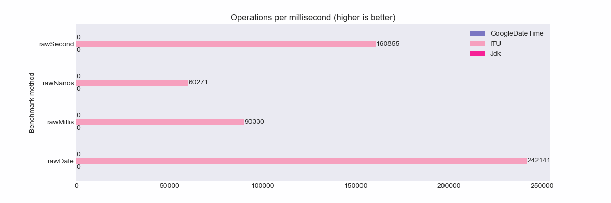

# Internet Time Utility

[](http://search.maven.org/#search%7Cga%7C1%7Cg%3A%22com.ethlo.time%22%20a%3A%22itu%22)
[](https://javadoc.io/doc/com.ethlo.time/itu/latest/com/ethlo/time/ITU.html)
[](LICENSE)
[](https://app.codacy.com/gh/ethlo/itu/dashboard?utm_source=gh&utm_medium=referral&utm_content=&utm_campaign=Badge_grade)

An extremely fast parser and formatter of ISO format date-times.

> Date and time formats cause a lot of confusion and interoperability problems on the Internet. This document addresses many of the problems encountered and makes recommendations to improve consistency and interoperability when representing and using date and time in Internet protocols.

This project's goal is to do one thing and to do it right; make it easy to
handle [Date and Time on the Internet: Timestamps](https://www.ietf.org/rfc/rfc3339.txt) and
W3C [Date and Time Formats](https://www.w3.org/TR/NOTE-datetime) in Java.

## Features
* Very easy to use
* No external dependencies, minimal JAR size (16.4KB)
* Apache 2 licensed, can be used in any project, even commercial
* Handling of leap-seconds
* Very high performance

## Performance

TL;DR: 30-100x faster than Java JDK classes.

### Parsing


### Formatting


The details and tests are available in a separate repository, [date-time-wars](https://github.com/ethlo/date-time-wars).

### Raw parsing
If you do not need to have the full verification of `java.time.OffsetDateTime`, 
you can use the raw, parsed data through `com.ethlo.time.DateTime` that incurs less overhead. 

Here it becomes even clearer how the parser scales with the length of the string that is parsed.


### Environment
The above results were captured on a Lenovo P1 G6 laptop:
* Intel(R) Core(TM) i9-13900H
* Ubuntu 23.10
* OpenJDK version 17.0.9

### Run tests yourself

The benchmarks are available in https://github.com/ethlo/date-time-wars.

## Usage

Add dependency

```xml
<dependency>
  <groupId>com.ethlo.time</groupId>
  <artifactId>itu</artifactId>
  <version>1.7.7</version>
  <!-- If you want to use minified JAR -->  
  <classifier>small</classifier>
</dependency>
```

Below you find some samples of usage of this library. Please check out the [javadoc](https://javadoc.io/doc/com.ethlo.time/itu/latest/com/ethlo/time/ITU.html) for more details.

```java
import java.time.OffsetDateTime;
import com.ethlo.time.DateTime;
import com.ethlo.time.ITU;

class Test {
    void smokeTest() {
        // Parse a string
        final OffsetDateTime dateTime = ITU.parseDateTime("2012-12-27T19:07:22.123456789-03:00");

        // Format with seconds (no fraction digits)
        final String formatted = ITU.formatUtc(dateTime); // 2012-12-27T22:07:22Z

        // Format with microsecond precision
        final String formattedMicro = ITU.formatUtcMicro(dateTime); // 2012-12-27T22:07:22.123457Z

        // Parse lenient, raw data
        final DateTime dateTime = ITU.parseLenient("2012-12-27T19:07Z");
    }
}
```

### Handle leap-seconds
```java
import com.ethlo.time.ITU;
import com.ethlo.time.LeapSecondException;
import java.time.OffsetDateTime;

class Test {
    void testParseDateTime() {
        try {
            final OffsetDateTime dateTime = ITU.parseDateTime("1990-12-31T15:59:60-08:00");
        } catch (LeapSecondException exc) {
            // The following helper methods are available let you decide how to progress
            exc.getSecondsInMinute(); // 60
            exc.getNearestDateTime(); // 1991-01-01T00:00:00Z
            exc.isVerifiedValidLeapYearMonth(); // true
        }
    }
}
```

### Handle different granularity (ISO format)
#### Validate with specified granularity
```java
import com.ethlo.time.ITU;
import com.ethlo.time.TemporalType;

class Test {
    void test() {
        ITU.isValid("2017-12-06", TemporalType.LOCAL_DATE_TIME);
    }
}
```

#### Handling different levels of granularity explicitly
```java
import com.ethlo.time.ITU;
import com.ethlo.time.TemporalHandler;

import java.time.LocalDate;
import java.time.LocalTime;
import java.time.OffsetDateTime;
import java.time.OffsetTime;
import java.time.ZoneOffset;
import java.time.temporal.TemporalAccessor;

class Test {
    TemporalAccessor extract() {
        return ITU.parse("2017-12-06", new TemporalHandler<>() {
            @Override
            public OffsetDateTime handle(final LocalDate localDate) {
                return localDate.atTime(OffsetTime.of(LocalTime.of(0, 0), ZoneOffset.UTC));
            }

            @Override
            public OffsetDateTime handle(final OffsetDateTime offsetDateTime) {
                return offsetDateTime;
            }
        });
    }
}
```
#### Parsing leniently to a timestamp
In some real world scenarios, it is useful to parse a best-effort timestamp. To ease usage, converting a raw `com.ethlo.time.DateTime` instance into `java.time.Instant` was added in 1.7.7. 

We can use `ITU.parseLenient()` with `DateTime.toInstant()` like this:

```java
import com.ethlo.time.ITU;
import com.ethlo.time.TemporalHandler;
import java.time.temporal.TemporalAccessor;

class Test {
    void parseTest() {
        final Instant instant = ITU.parseLenient("2017-12-06").toInstant();
    }
}
```

## Q & A

*Why this little project?*

There are an endless amount of APIs with non-standard date/time exchange, and the goal of this project is to make it a
no-brainer to do-the-right-thing(c).

*Why the performance optimized version?*

Some projects use epoch time-stamps for date-time exchange, and from a performance perspective this *may* make sense
in *some* cases. With this project one can do-the-right-thing and maintain performance in date-time handling.

This project is _not_ a premature optimization! In real-life scenarios there are examples of date-time parsing hindering optimal performance. The samples include data ingestion into databases and search engines, to importing/exporting data on less powerful devices, like cheaper Android devices.  

*What is wrong with epoch timestamps?*

* It is not human-readable, so debugging and direct manipulation is harder
* Limited resolution and/or time-range available
* Unclear resolution and/or time-range

## What is RFC-3339?

[RFC-3339](https://www.ietf.org/rfc/rfc3339.txt) is a subset/profile defined by [W3C](https://www.w3.org/) of the
formats defined in [ISO-8601](http://www.iso.org/iso/home/standards/iso8601.htm), to simplify date and time exhange in
modern Internet protocols.

Typical formats include:

* `2017-12-27T23:45:32Z` - No fractional seconds, UTC/Zulu time
* `2017-12-27T23:45:32.999Z` - Millisecond fractions, UTC/Zulu time
* `2017-12-27T23:45:32.999999Z` - Microsecond fractions, UTC/Zulu time
* `2017-12-27T23:45:32.999999999Z` - Nanosecond fractions, UTC/Zulu time
* `2017-12-27T18:45:32-05:00` - No fractional seconds, EST time
* `2017-12-27T18:45:32.999-05:00` - Millisecond fractions, EST time
* `2017-12-27T18:45:32.999999-05:00` - Microsecond fractions, EST time
* `2017-12-27T18:45:32.999999999-05:00` - Nanosecond fractions, EST time

## What is W3C - Date and Time Formats

[Date and Time Formats](https://www.w3.org/TR/NOTE-datetime) is a _note_, meaning it is not endorsed, but it still
serves as a sane subset of ISO-8601, just like RFC-3339.

Typical formats include:

* `2017-12-27T23:45Z` - Minute resolution, UTC/Zulu time
* `2017-12-27` - Date only, no timezone (like someone's birthday)
* `2017-12` - Year and month only. Like an expiry date.

## Limitations

### Local offset

For the sake of avoiding data integrity issues, this library will not allow offset of `-00:00`. Such offset is described
in RFC3339 section 4.3., named "Unknown Local Offset Convention". Such offset is explicitly prohibited in ISO-8601 as
well.

> If the time in UTC is known, but the offset to local time is unknown, this can be represented with an offset of "-00:00". This differs semantically from an offset of "Z" or "+00:00", which imply that UTC is the preferred reference point for the specified time.

### Leap second parsing

Since Java's `java.time` classes do not support storing leap seconds, ITU will throw a `LeapSecondException` if one is
encountered to signal that this is a leap second. The exception can then be queried for the second-value. Storing such
values is not possible in a `java.time.OffsetDateTime`, the `60` is therefore abandoned and the date-time will use `59`
instead of `60`. 


## Changelog

### Version 1.7.5

2023-12-28
* Releasing a minified version for scenarios where every KB counts. Use `<classifier>small</classifier>` to use it.
* Even faster parsing performance. 1.7.5 is more than twice as fast as 1.7.0!
* NOTE: Parsing to `OffsetDateTime` now emit error messages closer to parsing via `java.time`.

### Version 1.7.4

2023-12-26
* Parser performance improvements.

### Version 1.7.0

2022-09-03

* Added support for keeping number of significant fraction digits in second
* Added toString methods to `DateTime` for formatting.
* Added support for formatting date-times with other time-offsets than UTC.
* Vastly [improved javadoc](https://javadoc.io/doc/com.ethlo.time/itu/latest/com/ethlo/time/ITU.html).

### Version 1.6.1

2022-09-03

New helper methods were added to deal with different granularity.

* Validate to different required granularity.
* Allowing handling different levels of granularity.

### Version 1.6.0

2022-03-08

* `ITU.parseLenient(String)` now returns a custom `DateTime` object, which can be transformed to OffsetDateTime, LocalDateTime, etc, depending on how granular the fields in the input.
* Removed methods supporting the handling of `java.util.Date`.

### Version 1.5.2

2022-03-02

* Performance optimizations, especially formatting performance nearly doubled.
* Better error message for date-times with fractions, but missing time-zone.
* Rewrote benchmarks using [JMH](https://github.com/openjdk/jmh).

### Version 1.5.1

2022-02-28

ITU is now using a list of known leap-second dates in the past and keeps the current rule for date-times after the last known leap-second year/date. This will avoid breaking the parsing of valid leap second due to not having the very last updated list of leap-seconds. 

The `LeapSecondException` now has a new method to allow for checking if this is indeed a valid leap-second according to the list, via `isVerifiedValidLeapYearMonth()`.

### Version 1.5.0

2022-02-27

* Massive performance improvement for formatting
* IMPORTANT: Breaking change where previous versions returned null for null/empty input when parsing. This now throws an exception in line with the `java.time` classes.

### Version 1.4.0
2022-02-26
Upgrade test dependencies and restructure internals to be able to write more fine-grained tests.

### Version 1.3.0

2020-07-10

Support the parsing of leap seconds

### Version 1.2.0

2020-07-10

* Support parsing of sub-date formats (`Year` and `YearMonth`).ITU utility class with static methods
* No longer a need to create parser/formatter objects. Use static methods on `com.ethlo.time.ITU`.

### Version 1.1.0

2018-01-24

Support for space as date/time separator for parsing, as specified as optional in the RFC-3339.

### Version 1.0

2017-02-27

Initial release.
